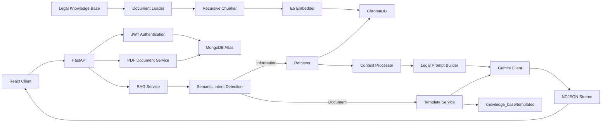

# JuriGPT

JuriGPT is a retrieval-augmented AI legal assistant for Indian law. It retrieves
grounded material from a curated knowledge base, streams multilingual answers,
preserves authenticated conversations in MongoDB Atlas, and can automatically
produce English PDF drafts for supported legal-document requests.

> JuriGPT provides legal information, not legal advice. Generated answers and
> document drafts should be reviewed by a qualified advocate before use.

## Features

- Curated legal document loading and recursive chunking
- E5 embeddings with persistent ChromaDB storage
- Semantic retrieval and overlap-aware context processing
- Grounded legal prompt construction with source attribution
- Gemini streaming responses using a provider-independent LLM interface
- Eleven selectable response languages
- JWT authentication backed by MongoDB Atlas
- Per-user conversation persistence, rename, search, and deletion
- Intent-routed legal document generation from isolated placeholder templates
- Mandatory-field follow-up questions that prevent invented names, dates, and amounts
- Professionally formatted, authenticated PDF exports for completed templates
- React, TypeScript, Tailwind CSS, Framer Motion, and responsive layouts

## Architecture



See [Architecture](docs/architecture.md) for component boundaries, runtime
flows, persistence, and deployment considerations.

## Repository layout

```text
backend/app/
  api/routes/       FastAPI transport layer
  core/             Dependency providers and environment configuration
  database/         MongoDB client and indexes
  llm/              Provider-independent LLM contracts and Gemini client
  rag/              Loaders, chunkers, embeddings, retrieval, and prompts
  schemas/          Pydantic API contracts
  services/         RAG, templates, authentication, conversation, and PDF services
  templates/        Template catalog, intent detection, loading, and filling
frontend/src/
  auth/             Authentication state and route protection
  components/       Reusable application and chat components
  pages/            Lazy-loaded login and workspace routes
  services/         Typed backend client
knowledge_base/     Curated knowledge plus an isolated templates/ directory
scripts/            Ingestion, rebuild, evaluation, and smoke tests
vector_dbs/chroma/  Persistent Chroma index
```

## Prerequisites

- Python 3.11 or newer
- Node.js 20 or newer
- MongoDB Atlas cluster
- Gemini API key
- Existing ChromaDB index, or source documents that can be ingested

## Environment configuration

Copy `.env.example` to `.env` at the repository root and replace every
placeholder:

```dotenv
GEMINI_API_KEY=...
GEMINI_MODEL=gemini-2.5-flash
TEMPERATURE=0.2
MAX_OUTPUT_TOKENS=2048
TIMEOUT=120

MONGODB_URI=mongodb+srv://...
MONGODB_DATABASE=jurigpt

JWT_SECRET_KEY=use-a-random-secret-containing-at-least-32-characters
JWT_ALGORITHM=HS256
ACCESS_TOKEN_EXPIRE_MINUTES=60
```

MongoDB creates the `users`, `conversations`, and `generated_documents`
collections and required indexes automatically.

For a separately hosted frontend, create `frontend/.env`:

```dotenv
VITE_API_BASE_URL=https://api.example.com
```

Leave `VITE_API_BASE_URL` unset during local development to use the Vite proxy.

## Local development

From the repository root:

```powershell
python -m venv .venv
.\.venv\Scripts\Activate.ps1
python -m pip install --upgrade pip
python -m pip install -r requirements.txt
python -m uvicorn backend.app.main:app --reload
```

In a second terminal:

```powershell
cd frontend
npm install
npm run dev
```

Open `http://localhost:5173`. Interactive backend documentation is available
at `http://127.0.0.1:8000/docs`.

## Knowledge-base ingestion

Place supported legal documents inside `knowledge_base/`, then run:

```powershell
.\.venv\Scripts\python.exe scripts\ingest.py
```

To rebuild the entire Chroma index:

```powershell
.\.venv\Scripts\python.exe scripts\rebuild_vectordb.py --yes
```

Do not change the embedding model without rebuilding the complete vector index.
The loader always excludes `knowledge_base/templates/`. Template Markdown,
source PDFs, and `catalog.json` are output formats and are never chunked or
embedded. Rebuild the Chroma collection once after upgrading an older
installation that previously indexed templates.

The rebuild command replaces the configured collection and therefore requires
the explicit `--yes` flag. Omit the flag to perform no destructive action.
Before embedding or resetting Chroma, the script rejects duplicate source
documents and duplicate deterministic chunk IDs, printing the conflicting
knowledge-base paths so the duplicate files can be removed safely.

## Production verification

```powershell
cd frontend
npm ci
npm run verify
```

`verify` checks Prettier formatting, ESLint, strict TypeScript compilation, and
the optimized Vite production bundle. Production assets are emitted to
`frontend/dist/`.

Backend syntax validation:

```powershell
.\.venv\Scripts\python.exe -m compileall -q backend\app
```

## API

All protected routes require:

```http
Authorization: Bearer <access_token>
```

The API supports authentication, normal and streamed legal answers,
conversation persistence, generated-document downloads, and process health.
See [API documentation](docs/api.md) for endpoint payloads and the streaming
event protocol.

## Testing

Individual pipeline smoke tests are available under `scripts/`, including:

- `test_loader.py`
- `test_chunker.py`
- `test_embedder.py`
- `test_vectorstore.py`
- `test_retriever.py`
- `test_prompt_builder.py`
- `test_llm.py`
- `test_rag_service.py`

Run tests from the repository root so relative knowledge-base and vector-store
paths resolve consistently.

## Current limitations

- The current `intfloat/e5-base-v2` index is optimized for English retrieval.
  Multilingual answers are supported, but multilingual questions may retrieve
  less relevant chunks until the index is rebuilt with a multilingual model.
- Generated PDF artifacts currently support English drafts. Indian-script PDFs
  require bundled Unicode fonts and production text shaping.
- A document can be generated only when it has a registered entry in
  `knowledge_base/templates/catalog.json` and every mandatory field has been
  supplied. Unsupported formats are reported instead of being invented.
- Conversation history is persistent, but it is not supplied to the LLM as
  multi-turn conversational memory.
