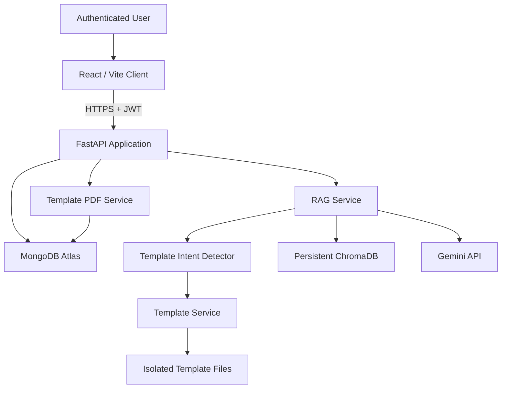
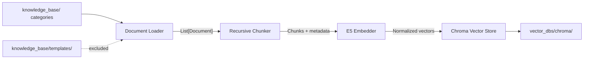
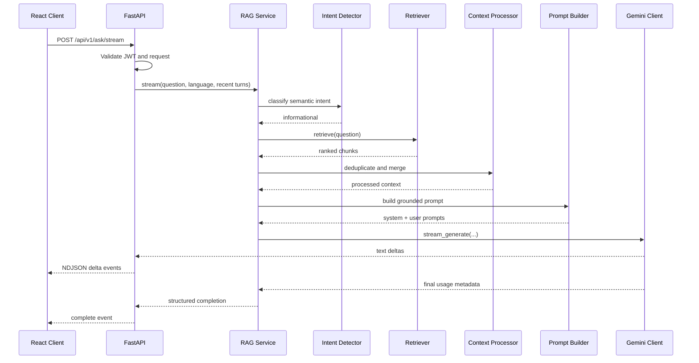
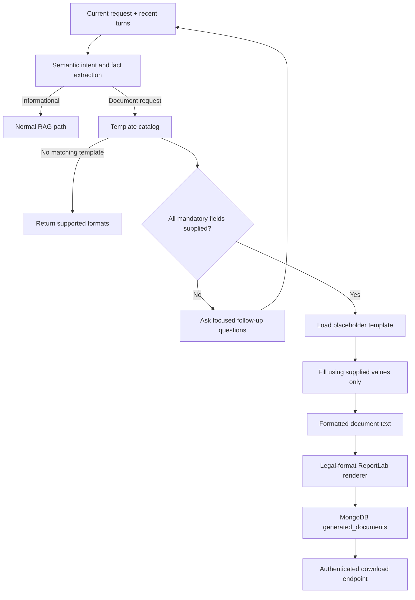
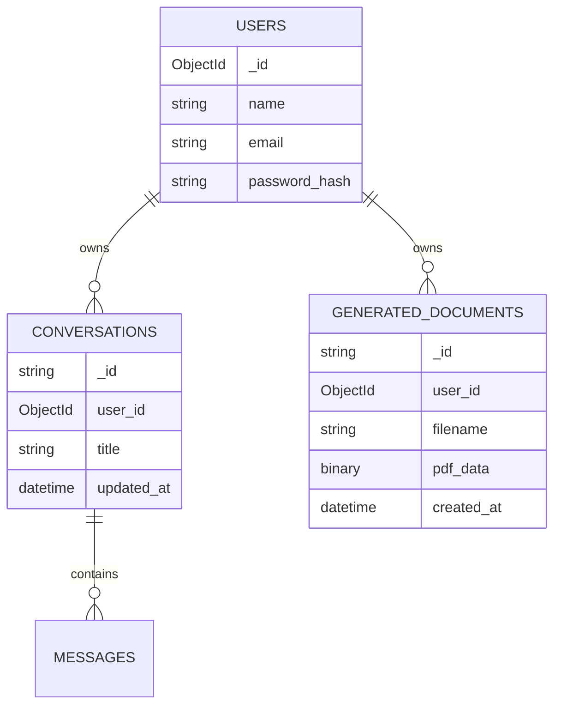

# JuriGPT architecture

## System context

The React client communicates only with FastAPI. It never accesses MongoDB,
ChromaDB, or Gemini directly.

## Offline ingestion pipeline

- The loader extracts source text and metadata.
- The loader excludes every file below `knowledge_base/templates/` by default.
- The chunker preserves metadata and produces deterministic chunk identifiers.
- The embedder creates normalized passage vectors.
- The vector store persists chunks and vectors. It does not perform retrieval.

Any stale Chroma result whose category or relative path identifies the template
folder is blocked before context processing. Deployments that previously
embedded templates must rebuild the collection to remove those vectors.

## Online informational-question flow

The API emits retrieval metadata before generation, incremental text deltas
during generation, and one final structured response. Partial deltas are not
written to MongoDB. The completed assistant message is persisted once.

## Legal-document generation

Template selection never queries ChromaDB. Definitions and placeholder Markdown
are read only from `knowledge_base/templates/`. Original source PDFs can remain
there as references without becoming knowledge chunks. Missing mandatory facts
stop generation; the assistant asks for them and recent conversation turns let
the next request continue the same draft. Unsupported document types do not
fall through to RAG.

The completed Markdown document is the canonical formatted text. The PDF
renderer maps headings, clauses, address/date blocks, signatures, witnesses,
page footers, and document spacing into a legal-document layout. PDF bytes are
stored with the authenticated user's ID and the download endpoint enforces the
same ownership check.

## Authentication and persistence

Passwords are hashed and never returned. JWT subjects contain the Mongo user
identifier. Every conversation and generated-document query includes the
authenticated user ID.

## Frontend performance boundaries

- Login and workspace pages are route-level lazy chunks.
- React, motion, Markdown, and HTTP dependencies are stable vendor chunks.
- Completed user and assistant messages are memoized, preventing historical
  Markdown responses from re-rendering for every streaming delta.
- Sidebar filtering and sorting are memoized by conversation list and query.
- Streaming text remains local to `ChatWindow`; persistence occurs only after a
  complete response.

## Service responsibilities

| Component | Responsibility |
| --- | --- |
| API routes | HTTP validation, authentication dependencies, response transport |
| RAG Service | Intent routing and orchestration of the selected pipeline |
| Template Service | Field collection, isolated template selection, and filling |
| Template Loader | Safe catalog and source-file loading from the template root |
| Intent Detector | Semantic information-versus-document classification |
| Placeholder Filler | Populate formats using explicit user values only |
| Retriever | Query embedding and Chroma similarity search |
| Context Processor | Deduplication and overlap merging |
| Prompt Builder | Context formatting and legal instructions |
| Gemini Client | Provider-specific generation and streaming |
| Conversation Service | Per-user MongoDB conversation CRUD |
| Document Service | Legal-format PDF rendering, storage, and retrieval |

## Deployment notes

- Serve FastAPI and the frontend over HTTPS.
- Set `VITE_API_BASE_URL` to the public API origin when deployed separately.
- Keep `.env`, Atlas credentials, JWT secrets, and Gemini keys outside source
  control.
- Persist `vector_dbs/chroma/` on durable storage.
- Use a reverse proxy configured not to buffer `application/x-ndjson` streams.
- Rebuild Chroma whenever the embedding model or source corpus changes.
- Rebuild Chroma after removing templates from an older mixed collection.
